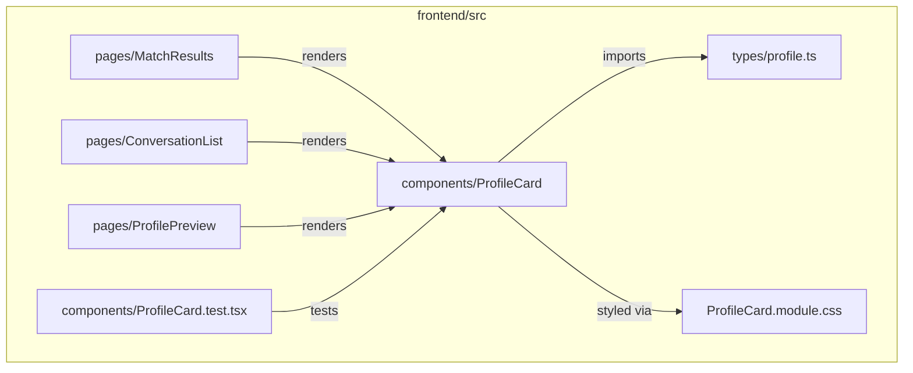
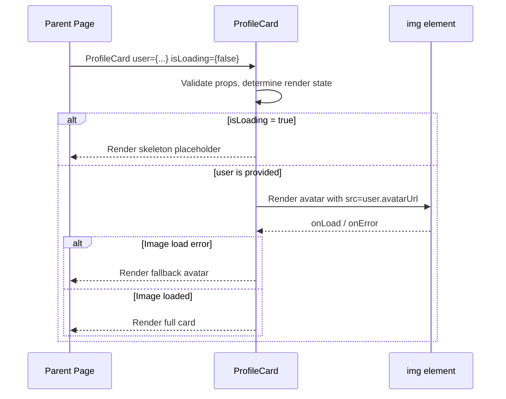

# Design Document: ProfileCard Component

## Overview

The ProfileCard is a presentational React component that displays a user's profile summary — their name, avatar photo, and a short bio. It lives in the shared component library at `frontend/src/components/ProfileCard.tsx` and is designed to be reused across multiple pages (match results, conversation lists, profile previews).

The component handles three visual states beyond the happy path: loading (skeleton placeholder), error (failed image or data fetch), and empty (missing optional fields). It follows the project's functional-component-only, named-export, one-component-per-file conventions and meets WCAG AA accessibility standards.

## Architecture



### Component Data Flow



## Components and Interfaces

### Component: ProfileCard

**Purpose**: Renders a user's profile summary card with avatar, name, and bio.

**Interface**:
```typescript
interface ProfileCardProps {
  /** User profile data to display. When undefined and isLoading is false, renders empty state. */
  user?: UserProfile;
  /** Shows skeleton loading state when true. */
  isLoading?: boolean;
  /** Optional CSS class for layout overrides by parent. */
  className?: string;
  /** Optional size variant. Defaults to 'md'. */
  size?: 'sm' | 'md' | 'lg';
}

export const ProfileCard: React.FC<ProfileCardProps>;
```

**Responsibilities**:
- Render user avatar, name, and bio from `UserProfile` data
- Display a skeleton placeholder when `isLoading` is true
- Show a fallback avatar when `avatarUrl` is missing or the image fails to load
- Gracefully handle missing optional fields (bio, avatarUrl)
- Apply size variant styling
- Forward `className` for parent layout control

### Component: ProfileCardSkeleton (internal)

**Purpose**: Renders an animated placeholder matching the card's layout during loading.

**Interface**:
```typescript
// Internal — not exported. Rendered by ProfileCard when isLoading=true.
const ProfileCardSkeleton: React.FC<{ size: 'sm' | 'md' | 'lg' }>;
```

**Responsibilities**:
- Render pulsing placeholder shapes for avatar circle, name line, and bio lines
- Match dimensions of the corresponding `size` variant
- Announce loading state to screen readers via `aria-busy`

## Data Models

### UserProfile

```typescript
// frontend/src/types/profile.ts

export interface UserProfile {
  /** Unique user identifier. */
  id: string;
  /** User's display name. */
  displayName: string;
  /** URL to the user's avatar image. Optional — fallback shown when missing. */
  avatarUrl?: string;
  /** Short bio text. Optional — section hidden when missing. */
  bio?: string;
}
```

**Validation Rules**:
- `id` must be a non-empty string
- `displayName` must be a non-empty string (trimmed)
- `avatarUrl`, when provided, must be a valid URL string
- `bio`, when provided, should be capped at 160 characters for display (truncated with ellipsis)


## Correctness Properties

*A property is a characteristic or behavior that should hold true across all valid executions of a system — essentially, a formal statement about what the system should do. Properties serve as the bridge between human-readable specifications and machine-verifiable correctness guarantees.*

### Property 1: Profile data rendering completeness

*For any* valid UserProfile with all fields populated, rendering the ProfileCard should produce output containing the displayName as visible text, an image element with the avatarUrl as its source, and the bio text within the card.

**Validates: Requirements 1.1, 1.2, 1.3**

### Property 2: Loading state hides user content

*For any* UserProfile (including undefined), when isLoading is true, the ProfileCard should render the ProfileCardSkeleton with aria-busy set to true, and should not render any user content (displayName, avatar image, or bio).

**Validates: Requirements 2.1, 2.4, 7.3**

### Property 3: Missing optional fields are gracefully omitted

*For any* UserProfile where avatarUrl is absent, the ProfileCard should render the Fallback_Avatar. *For any* UserProfile where bio is absent, the ProfileCard should not render a bio section element.

**Validates: Requirements 3.2, 4.2**

### Property 4: Bio truncation at 160 characters

*For any* UserProfile with a bio longer than 160 characters, the ProfileCard should display exactly 160 characters of the bio followed by an ellipsis. *For any* bio of 160 characters or fewer, the full bio should be displayed without truncation.

**Validates: Requirements 1.4, 8.4**

### Property 5: Size variant CSS class application

*For any* valid size prop value (sm, md, lg), the ProfileCard should apply the corresponding CSS class to the root element. When no size prop is provided, the md class should be applied.

**Validates: Requirements 5.1, 5.2**

### Property 6: className prop forwarding

*For any* className string, the ProfileCard root element should contain both the provided className and the component's default CSS module class.

**Validates: Requirement 6.1**

### Property 7: Avatar alt attribute contains displayName

*For any* valid UserProfile, the rendered avatar image should have an alt attribute that contains the user's displayName.

**Validates: Requirement 7.1**

### Property 8: UserProfile validation

*For any* string value, the UserProfile id and displayName fields should reject empty strings and whitespace-only strings. *For any* avatarUrl value, validation should accept only valid URL strings.

**Validates: Requirements 8.1, 8.2, 8.3**
